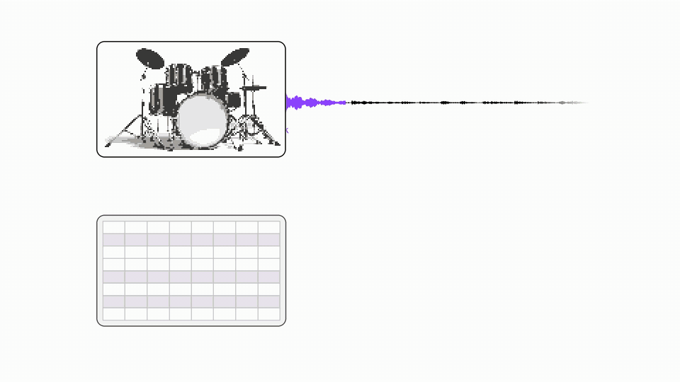

<p align="center">
  <picture>
    <source media="(prefers-color-scheme: dark)" srcset="assets/dcomposer-dark.svg">
    
  </picture>
</p>

# D-Composer: Language Modeling for Simultaneous Drum Transcription and Sound Event Decomposition

[](https://d-composer.github.io/assets/paper/DComposer_ISMIR_2026.pdf)
[](https://d-composer.github.io/)

This repository contains training, inference, and evaluation code for __D-Composer__, a neural network system that decomposes drum recordings into isolated one-shots and a transcript arranging them.

**At this time, we do not provide model weights or private one-shot training data.**
You can [train D-Composer on your own data](#training); see
[Model Weights](#model-weights) for more information.

<p align="center">
  
</p>

## Installation

We recommend using Python 3.11 or newer. Run the following commands:

```bash
python -m venv .venv
source .venv/bin/activate
# In this example, we use CPU; use the appropriate PyTorch CUDA builds for GPU training/inference.
pip install torch==2.7.0 torchaudio==2.7.0 --index-url https://download.pytorch.org/whl/cpu
pip install -e .
# In this example, we download only the MelodyFlow VAE
python scripts/download_codecs.py --run.codec melodyflow
```

This will install dependencies and download a pretrained VAE model on which D-Composer's drum one-shot codec (DOC) can be trained. We currently support the following VAEs:

| Model | Official weights | Access |
| --- | --- | --- |
| `melodyflow` | [Meta MelodyFlow](https://huggingface.co/facebook/melodyflow-t24-30secs) | Public |
| `codicodec` | [Sony CoDiCodec](https://huggingface.co/SonyCSLParis/CoDiCodec) | Public |
| `stable_audio` | [Stable Audio Open](https://huggingface.co/stabilityai/stable-audio-open-1.0) | Requires permission |

Select another VAE with `--run.codec codicodec` or `--run.codec stable_audio`. For Stable
Audio, accept its terms, install `huggingface_hub`, and run `hf auth login`
before downloading.

## Training

D-Composer is trained in two stages: first, we train a drum one-shot codec (DOC) to map between one-shot recordings and short acoutsic token sequences; then, we train the D-Composer language model using acoustic tokens obtained from DOC.

D-Composer requires **isolated drum samples and MIDI drum scores**; we provide scripts to download and prepare publicly available datasets, but for best results you will want to provide additional one-shots of your own.

### Prepare Your Data

To download and prepare publicly available training data, run:

```bash
python scripts/prepare_training_data.py --download --output manifests/training
```

This fetches and processes the following datasets:

| Training dataset | Download | Extracted | Additional setup storage | Scripts |
| --- | ---: | ---: | ---: | --- |
| Organic Drum One-Shots | 0.29 GB | 0.29 GB | 0.74 GB packed audio | [Download](scripts/download/download_organic_one_shots.sh), [setup](scripts/setup/create_organic_one_shots_manifests.py) |
| Lakh MIDI | 1.8 GB | 6.0 GB | 2.3 GB event cache | [Download](scripts/download/download_lmd.sh), [setup](scripts/setup/create_lmd_manifests.py) |
| Groove MIDI (GMD) | 3.3 MB | 5.7 MB | 6 MB event cache/CSVs | [Download](scripts/download/download_groove_midi.sh), [setup](scripts/setup/create_groove_midi_manifests.py) |
| RIRS_NOISES | 1.3 GB | 3.8 GB | CSVs only | [Download](scripts/download/download_extra_augs.sh), [setup](scripts/setup/create_extra_aug_manifests.py) |
| MIT IR | 12 MB | 17 MB | CSVs only | (Same scripts) |

Allow **38 GB for publicly available data after processing**, excluding model weights and training checkpoints. The individual download/setup scripts are called by the above `prepare_training_data` command, and require `wget`, `unzip`, and `git`.

**Bring your own data:** Organize your one-shot samples into a directory with subdirectories for drum classes (`kick/`, `snare/`, `hat/`, etc.), and include at least three samples for each class present in your data. Put MIDI files in a directory and split them between `train/` and `val/` subdirectories; our code assumes MIDI data follows the [General MIDI specification](https://en.wikipedia.org/wiki/General_MIDI), with all drum notes on channel 10. Your one-shot samples should cover the drum classes in your scores. Prepare both with:

```bash
python scripts/prepare_training_data.py \
    --oneshots /path/to/oneshots_directory --midi /path/to/midi_directory \
    --output manifests/training
```

This command packs audio, caches MIDI events, and writes CSVs to
`manifests/training/` for data loading. See [data layout](manifests/examples/layout.txt) and [sample CSV](manifests/examples/oneshots.csv) for more information on supported data formats.

### Train

**Single GPU:** Train the two models in order:

```bash
python scripts/train_flow_autoencoder.py --args.load conf/doc.yml \
    --save_path runs/doc --use_ema
python scripts/train_dcomposer.py --args.load conf/dcomposer.yml \
    --save_path runs/dcomposer \
    --codec_run_dir runs/doc --codec_checkpoint best --codec_use_ema
```

**Multiple GPUs:** For two GPUs, use these commands instead:

```bash
torchrun --nproc_per_node 2 scripts/train_flow_autoencoder.py --args.load conf/doc.yml \
    --save_path runs/doc --use_ema
torchrun --nproc_per_node 2 scripts/train_dcomposer.py --args.load conf/dcomposer.yml \
    --save_path runs/dcomposer \
    --codec_run_dir runs/doc --codec_checkpoint best --codec_use_ema
```

The first command saves DOC and its exponential-moving-average (EMA) weights
in `runs/doc`. The second command loads the trained DOC checkpoint from `runs/doc/best/ema_model.pt` and trains D-Composer, saving checkpoints in `runs/dcomposer`. Keep both run directories, including `conf.yml`
and `extras.pt`, for inference.

The configs referenced above follow the paper's training settings, with the unavailable private sample libraries replaced by your prepared collection. Alternate DOC configs are provided at `conf/codec/codicodec.yml` and `conf/codec/stable_audio.yml`.


## Inference

To decompose a directory of drum recordings with your trained models, run:

```bash
bash scripts/run_decomposition_pipeline.sh \
    --input_dir /path/to/drum_recordings --output_dir outputs/example \
    --dcomposer_run_dir runs/dcomposer \
    --codec_run_dir runs/doc --codec_checkpoint best --codec_use_ema
```

This writes MIDI to `outputs/example/transcripts/`, one-shot WAVs to `outputs/example/oneshots/`, and reconstructed recordings to `outputs/example/roundtrip/`. By default, recordings over four seconds are processed in four-second windows with one second overlap.

## Evaluation

The D-Composer system presented in the paper is evaluated on E-GMD, MDB Drums, FSL10K, and drum mixtures synthesized from unavailable private one-shots. To download the publicly available evaluation data, run:

```bash
python scripts/prepare_evaluation_data.py
```

The datasets are summarized below.

| Evaluation dataset | Download | Extracted | Additional setup storage | Scripts |
| --- | ---: | ---: | ---: | --- |
| Expanded Groove MIDI (E-GMD) | 90 GB | 132 GB | None | [Download](scripts/download/download_e_gmd.sh) |
| MDB Drums (isolated drums + annotations) | ~0.12 GB payload | ~0.12 GB | Git metadata; allow 0.3 GB total | [Download](scripts/download/download_mdb_drums.sh) |
| FSL10K | 8.8 GB | 11.1 GB | CSVs only | [Download](scripts/download/download_loops.sh), [setup](scripts/setup/create_loops_manifests.py) |

Allow **230 GB additional free space** for evaluation setup.

Next, create evaluation excerpts and synthetic mixtures using the
validation MIDI and samples specified in your training config:

```bash
python scripts/create_eval_inputs.py --output_dir eval/inputs \
    --dcomposer_config runs/dcomposer/conf.yml --seed 0 \
    --n_e_gmd 1000 --n_mdb_drums 1000 --n_fsl10k 500 --n_synthetic 2000
```

This writes recordings and reference transcripts/one-shots to `eval/inputs/`.

To generate predictions with your trained model and compute decomposition metrics, run:

```bash
python scripts/replicate_paper.py --config conf/replication/inference.yml \
    --inputs eval/inputs --output eval/dcomposer \
    --model runs/dcomposer --decoder runs/doc
```

This writes predictions to `eval/dcomposer/predictions/` and metrics to `eval/dcomposer/scores/table3_mse.md` alongside a summary, per-recording CSVs, and a TeX table.

As in the paper, transcription is evaluated on E-GMD, MDB Drums, and synthetic mixtures;
one-shot extraction is evaluated on synthetic mixtures; and round-trip reconstruction is evaluated on all four data sources.

## Model Weights

As discussed in our [paper](https://d-composer.github.io/assets/paper/DComposer_ISMIR_2026.pdf),
D-Composer is trained on one-shots from royalty-free commercial libraries. The
licenses of these libraries prohibit the redistribution of assets in
"repackaged" form even in non-commercial contexts. While these licenses do not
assert whether AI models trained on assets may constitute such a repackaging,
we initially refrain from releasing model weights as we work to resolve this
ambiguity. We emphasize that the models trained in this work are intended for
educational and research purposes, and we do not propose their use for commercial
purposes.

We are currently exploring ways to responsibly release components of our system
in a manner compliant with the spirit of the data licenses, and to provide weights
for models trained on public-domain datasets.

## Licenses

This repository is provided under the MIT license (see `LICENSE`) with the exception of code and weights adapted from existing repositories, licensed as follows:

| Directory | Source | Code license |
| --- | --- | --- |
| `dcomposer/pipelines/tokenizer/melodyflow` | AudioCraft | MIT |
| `dcomposer/pipelines/tokenizer/codicodec` | CoDiCodec | CC BY-NC 4.0 |
| `dcomposer/pipelines/tokenizer/stable_audio` | Stable Audio Tools | MIT |
| `dcomposer/transforms/dasp` | DASP | Apache 2.0 |


## Citation

If you use this code, please cite:

```bibtex
@inproceedings{oreilly2026dcomposer,
  author = {O'Reilly, Patrick and Pailwan, Saumya and Chu, Annie and Smith, Jason and Pardo, Bryan},
  title = {{D-Composer}: Language Modeling for Simultaneous Drum Transcription and Sound Event Decomposition},
  booktitle = {Proceedings of the 27th International Society for Music Information Retrieval Conference (ISMIR)},
  year = {2026},
}
```
